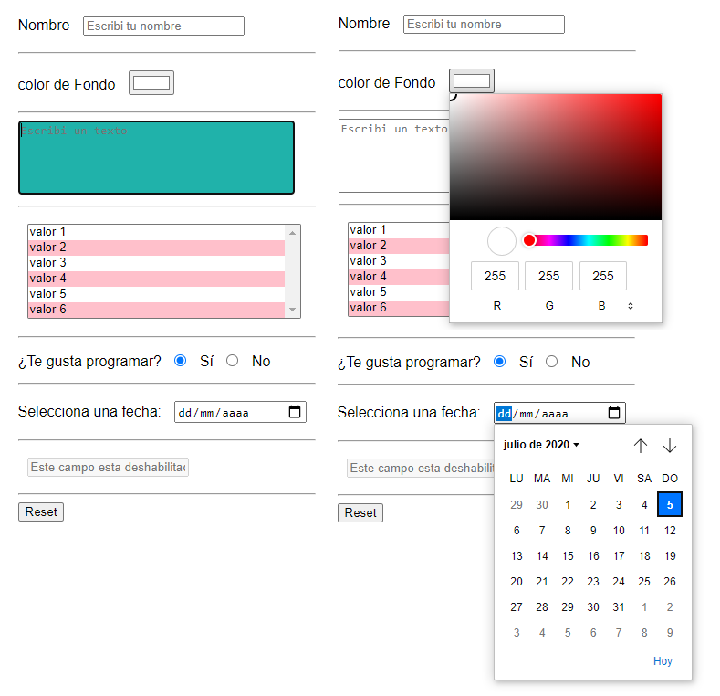

# Instrucciones

* Que en dentro del `input` de nombre se lea *"escribí tu nombre"* a modo de ejemplo.
* Hacer que el campo de nombre sea **obligatorio**

* buscar un **tipo de `input`** que sirva para que el usuario pueda elegir cualquier color para el fondo. Este `input` tiene que tener como `ID` **color**.

* Que a la etiqueta `textarea` no se le pueda cambiar el tamaño.
* Que el maximo de caracteres de `textarea` sea de 280.
* Que cuando el usuario haga click dentro de `textarea` el fondo de la misma sea: *lightseagreen* y el color de la letra sea: *black*

* Que en el `select` se puedan seleccionar **varias opciones**.
* Que cuando cargue la pagina se vean **todas las `opciones`** que estan dentro del `select`.
* Dentro de las **opciones** del `select`, las que son *PARES* tengan fondo color *pink*

* Que el input `radio button` aparezca con la opcion **Sí** ya seleccionada

* Crear un `input` en donde el usuario pueda elegir una **fecha**.

* Que el input con `name="deshabilitado"` no pueda ser editado.

* Agregar un `boton` para que se borren **todos los campos** que hayan sido completados.

## Ayuda:

Asi deberia quedar cuando todo este terminado:

